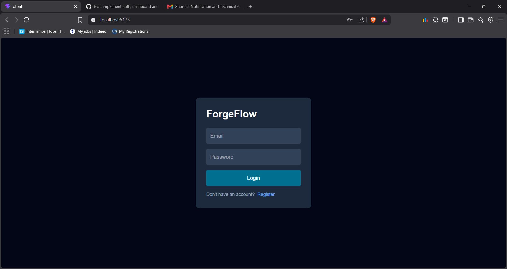
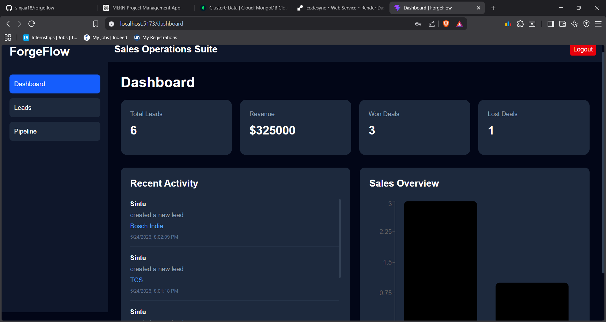
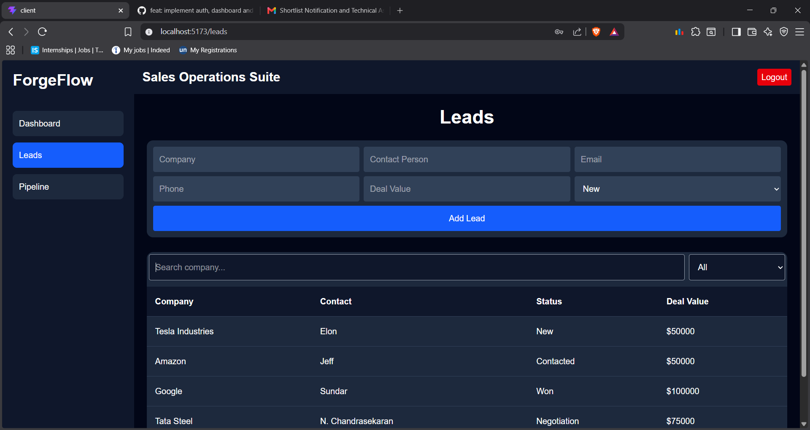
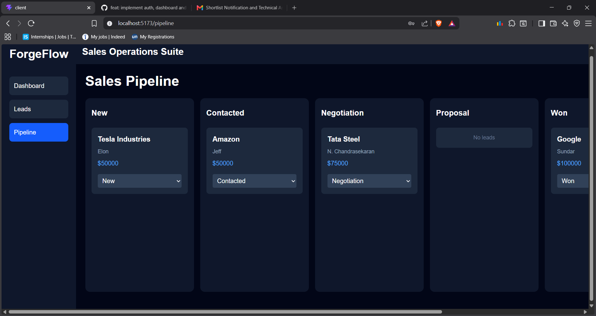

# 🚀 ForgeFlow CRM


A full-stack CRM platform built for Business Development teams in manufacturing companies.

ForgeFlow helps teams manage leads, track sales pipelines, monitor activities, and visualize business performance through a clean and responsive dashboard.

---

# 🌐 Live Demo

## Frontend
https://forgeflow-puce.vercel.app

## Backend API
https://forgeflow-36t8.onrender.com

---

# ✨ Features

## 🔐 Authentication
- User Registration
- User Login
- JWT Authentication
- Protected Routes
- Persistent Sessions

---

## 📋 Lead Management
- Create Leads
- View Leads
- Sales Pipeline Workflow
- Search & Filter Leads
- Update Lead Status
- Deal Value Tracking

---

## 📊 Dashboard
- Total Leads
- Revenue Tracking
- Won/Lost Deal Analytics
- Activity Timeline
- Sales Overview Charts

---

# 📸 Screenshots

## Login



---

## Dashboard



---

## Leads Management



---

## Sales Pipeline



---

# 🛠️ Tech Stack

## Frontend
- React
- Tailwind CSS
- React Router DOM
- Recharts
- Vite

---

## Backend
- Node.js
- Express.js
- MongoDB
- Mongoose
- JWT Authentication
- bcryptjs

---

# 🧠 Architecture

```text
Client (React)
      │
      ▼
REST API (Express.js)
      │
      ▼
MongoDB Atlas
```

Authentication Flow:

```text
User Login
    │
    ▼
JWT Token Generated
    │
    ▼
Protected API Requests
```

---

# 📂 Folder Structure

```text
forgeflow/
│
├── client/
│   ├── src/
│   │   ├── components/
│   │   ├── config/
│   │   ├── pages/
│   │   └── App.jsx
│
├── server/
│   ├── src/
│   │   ├── controllers/
│   │   ├── middleware/
│   │   ├── models/
│   │   ├── routes/
│   │   └── index.js
│
└── README.md
```

---

# 🔑 Environment Variables

## Backend `.env`

```env
PORT=5000

MONGO_URI=your_mongodb_uri

JWT_SECRET=your_secret
```

---

## Frontend `.env`

```env
VITE_API_URL=your_backend_url/api
```

---

# ⚙️ Installation & Setup

## Clone Repository

```bash
git clone https://github.com/sinjaa18/forgeflow.git

cd forgeflow
```

---

# 🖥️ Backend Setup

```bash
cd server

npm install

npm run dev
```

Backend runs on:

```txt
http://localhost:5000
```

---

# 💻 Frontend Setup

Open another terminal:

```bash
cd client

npm install

npm run dev
```

Frontend runs on:

```txt
http://localhost:5173
```

---

# 📡 API Endpoints

## 🔐 Auth Routes

```http
POST /api/auth/register
POST /api/auth/login
```

---

## 📋 Lead Routes

```http
GET /api/leads
POST /api/leads
PUT /api/leads/:id
GET /api/leads/stats
```

---

## 📊 Activity Routes

```http
GET /api/activity
```

---

# 🔒 Security Features

- Password Hashing using bcryptjs
- JWT Authentication Middleware
- Protected Backend Routes
- Secure REST API Architecture

---

# 🚀 Future Improvements

- Role-Based Access
- Lead Assignment System
- Notifications
- Email Integration
- Advanced Analytics
- Real-time Updates

---

# 👨‍💻 Author

## Sintu Kumar

GitHub:
https://github.com/sinjaa18

LinkedIn:
https://www.linkedin.com/in/sintu-kumar-83350b324

---

# ⭐ Support

If you found this project useful, consider giving it a star on GitHub.